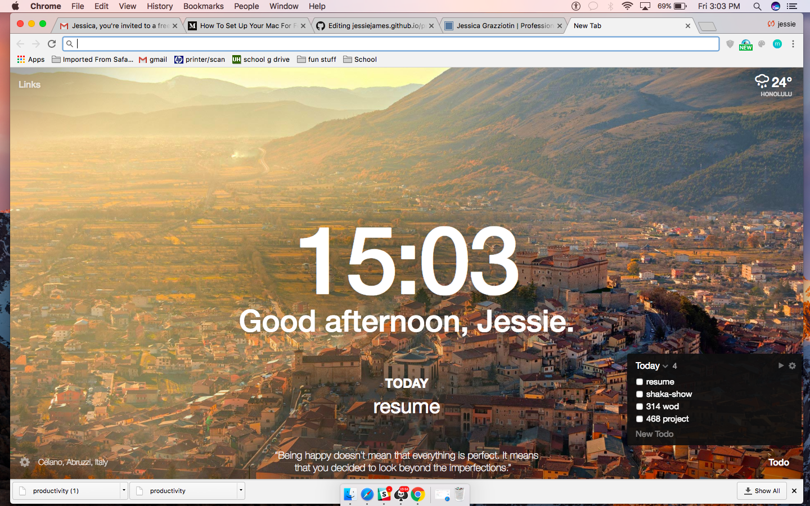
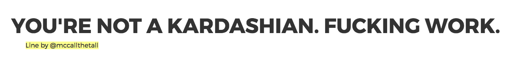

<h1> This is just a collection of sites, apps, & articles that help me become more focused and productive. </h1>
<h2> Just tring to share with the world.  </h2>

  

# 1
This article showed me how to take 15 min to set up my Macbook for [More Focused Work](https://betterhumans.coach.me/how-to-set-up-your-mac-for-focused-work-ab3565750059). It has a list of simple techniques and free apps to download to make work life easier and more focused. I really like this Chrome extension called [Momentum](https://momentumdash.com/). 
  

  
# 2
This article had a lot of mental tips for staying focused. One was to practice *looking* at something in the room. Like pick anything in the room right now and just stare at if for a really long time. He describes it as a meditation experience that really can quiet the chaos around you. 
It's called [*Constantly Getting Burned Out? These 3 Things Are What Keep Me Crazy Focused*](https://medium.com/personal-growth/constantly-getting-burned-out-these-3-things-are-what-keep-me-crazy-focused-e9fa3778624) by Nicolas Cole.

### ... I'm sure there will be more to come. This is a list I will continue to add to. 

