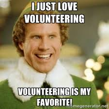

## *It's Easy to See That Time is Money*
# SO WHY NOT SEE VOLUNTEERING AS AN INVESTMENT?

  

In some ways, I've been a volunteer junkie my whole life. Whether it was getting myself involved in club leadership positions or signing my weekends away, I have always found someway to be helping in a million activities that I'm not getting paid for. However, as time has progressed, I have decided that some of my best professional decisions were my volunteer experiences. Now I'm not going to talk about the butterfly stories and sugar coated reasons that your high school counserlors told you: *"you'll make friends, you'll feel good about helping someone, you'll make the world a better place"*. The reasons I'll present are strictly career oriented. 

 
## 1.0 You'll Learn What You Like

When entering the realm of tech, there are soooo many niches that you can work in: cybersecurity, embedded systems, web dev, dev ops, big data, AI, AR, VR, IoT, and the list goes on. There is NO way that you will have enough time to take courses on each of these subjects individually. Of course there are free online tutorials, but is that what *working* in that field is like? Why not volunteer for something that you're interested in. If there's a hackathon based on one of these topics, and you're really interested, but your imposter syndrome won't let you sign up. Or you just don't have time to dedicate all weekend, but you have maybe a few hours to spare: <b> try volunteering to help at a hackathon! </b> Even though you won't be on a team, you will probably find some time to hop in and see what the teams are doing and ask questions. In doing this, you can get a quick feel for what this niche is all about by seeing more than one example in a short amount of time. 

Personal Experience: I found out I liked fashion tech by helping organize a fashion tech workshop. 
 
## 1.1 You'll Learn What You Don't Like
This just follows up on the idea above, but can be as equally as important. What if you dedicated a whole 6 month course to a topic you found out you just weren't as interested in as you thought. Or what if you are too far into a new project you were trying out? You don't want to give up and hurt your credibility, but you've discovered that you are not passionate about the subject. We've all been through this, but sometimes volunteering for a project of this flavor is an easier way to pass up this unfortunate circumstance.  

Personal Experience: I'm not interested in Minecraft after helping kids learn to code in it. 

  
## 2.0 Fun Group Projects
Almost every interviewer wants to know the details on the group projects you've worked on. But it's hard to get a long list of big group projects on your resume before graduating. *Have no fear, volunteering is here!* If you don't have the time to sign on to a big group project, try looking for a short term, big group volunteer opportunity. Maybe a weekend clean up crew or workshop activity to help in. Anything that shows that you worked with others and participated in planning and separating tasks will look great to an employer. Plus, it will help you learn what group position you feel most comfortable in. Do you like taking the lead in decisions or would you rather help out with what needs to get done. 

Personal Experience: I enjoyed so many projects that I did through the local hackerspace (HiCapacity). Everyone comes from such different backgrounds that there is always someone that will teach you something you don't know. Also shoutout to the Transpiler project team. I'm learning so much from everyone. We're all on different levels, but everyone is humble about it, and keeping up with the pace. 

  
## 2.1 Awkward Group Projects

Similar to 1.1, this follows up on 2.0. A very important story that interviewers look for is how you handled an awkward or even miserable group experience. Wheter it was a bad egg on the team or a misunderstanding of responsibilities, bad group experiences are important lessons that everyone must go through to prepare them for the future. Why? Because it will never go away. That's right, even as adolecents become adults, these awkward situations pop up in the workplace and an employer wants to know that you won't go postal or give up just because the team isn't working well together. So by volunteering, you get a chance to test the waters, and if the group experience is bad, at least it doesn't affect your grade, or worse, your paycheck. You can also test out different methods to solve these issues like talking about it with a mentor, or just confronting the person straight on. These decisions might be more risky in a work or class setting, but as a volunteer, you won't feel as worried to test the waters. 

Personal Experience: I went through a really tough, year long, group project once. I learned that regardless of the outcome, if the bad vibe starts disturbing progress & talking in the group isn't helping, it's best to talk to a mentor. Otherwise the mentor won't know until it's too late and then everyone looks bad. 

  
## 3.0 Networking
If you don't already know the merit in networking, then I wish you luck on all of your future endeavors. I, however, have seen networking to be the primary first foot in the door for many job positions. This is why I really like volunteering for community tech events.

School led tech events are great, but they usually are primarily made up of student volunteers who are all at the same experience level. Volunteering for community events allows you to network with individuals who are working in the industry. These connections could turn into great reference letters, recommendations, or just general insight to gain about working in the industry at a certain location. Maybe you'll find out about a company that you hadn't heard of or a position that is opening up somewhere soon. You never know whose hand your shaking. 

Personal Experience: I got my first internship through a voluntary school project. Then I got my next internship, by volunteering for outreach events at the first internship. 

## 4.0 Ok I Lied, Everything Your Counselor Said Actually is True & Important
The making friends, feeling good about yourself, and help make the world a better place are actually all true. Something I had underestimated from joining all of the clubs I'm involved in at school is that I have made so many friends. It's so nice when I start a new semester and I recognize a familiar face from HKN in my classes. Or when I notice that my IEEE buddy is always heading to Starbucks the same time I am. I have met all of these people through numerous outreach events. During volunteer events you usually have some downtime to socialize a little and find out more about someone than how they did on last weeks quiz. And studies show that we as social creatures, need these bonds to be a more mentally stable, and thus, productive.  

Now the feel good about yourself part should be a given. No matter how small the task, if you weren't there to do it, it means that someone else would have needed to do it, or it would not have gotten done. Sometimes even little gestures can make a big difference. So you should feel good for helping make someone's life a little easier, which in the end, will <b>make the world a better place</b>. 

