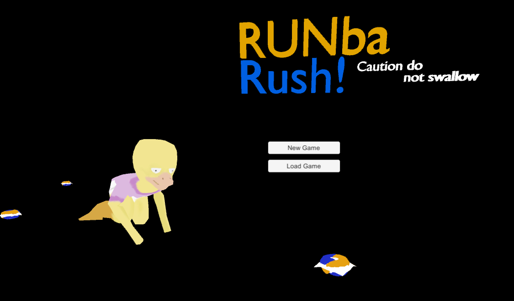
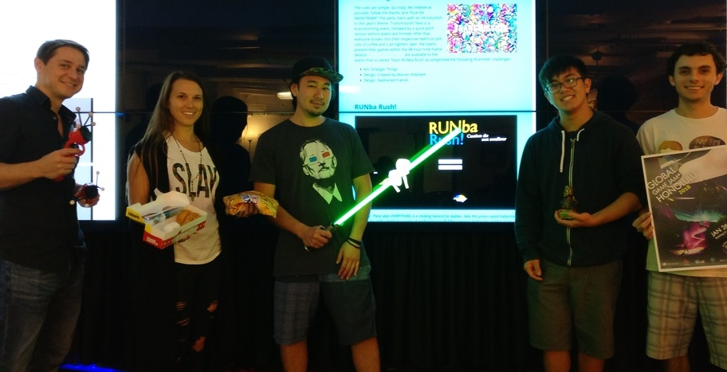

## First, What's Global Game Jam? 

  
This year at the 2018 Global Game Jam our team (Team Tydepod Toddlers) created a logic game called RUNba Rush! Here are all the details of the game and our experience. For more information about the Global Game Jam and Honolulu's Jam site click [here](https://medium.com/@spyhi/hey-honolulu-global-game-jam-2018-is-from-january-26-18-lets-get-ready-5f5c518962a). 

      
## The Challenge
 

The rules are simple. Go crazy, be creative as possible, follow the theme, and *"Fuck the MAINSTREAM!"* The party starts with an introduction to this year's theme: Transmission! Next is a brainstorming event, followed by a quick pitch session before teams are formed. After that, everyone breaks into their respective teams to *Jam*. Lots of coffee and 2 all nighters later, the teams present their games within the 48-hour time frame. Several [diversifier categories](https://globalgamejam.org/news/ggj18-diversifiers) are available to the teams that so dared. Team RUNba Rush! accomplished the following diversifier challenges: 
- Art: Stranger Things
- Design: Created by Warren Robinett
- Design: Feathered Friends

  
# RUNba Rush!
 
   

*Summary: These days EVERYTHING is a choking hazard for babies. 
Help this preoccupied babysitter transmit the right signals to a series of malfunctioning RUNba sweepers before the toddler meets sudden death!* 
[CLICK HERE FOR THE RUNBA RUSH! OFFICIAL GLOBAL GAME JAM SITE TO PLAY](https://globalgamejam.org/2018/games/runba-rush)
[Trailer](https://drive.google.com/open?id=1QB_ZELsZKCLjs9ac2qSWuBwOoryHcHsi)

      
## Narrative / Motives / Setting
Have you ever witnessed the inevitability of a child attempting to eat the most dangerous object in the house? Have you ever used a controller that didn't quite work the way you wanted? Well as our babysitter, you will experience both today! Unbeknownst to these duck / human parents, once they leave the house this babysitter decides to invite her boyfriend over. Enjoying her company on the living room sofa, she lazily tries to use the remote controlled RUNba vaccums to clean up the hazards on the floor; hazards that a hungry toddler is trying to eat. 

The motive of this game is to help our babysitter clean up the hazards on the floor before the baby can eat them. Sure, some objects may be bizarre, but what isn't for a turn of the millenium duck / human species. *So hide ya weapons, hide ya tools, and hide ya Tide Pods, cuz they're eating everything in here* You'll quickly realize that some of the RUNbas aren't moving in the transmitted directions, but have instead, determined their own interpretations for your inputs (example: left arrow = down). 

While playing, feel free to enjoy the old school jams mixed with easter eggs of today's top viral hits.

  
## Team Tyde Pod Toddlers

(Pictured from left to right) 
- [Will Watson](http://odysseusadrift.wixsite.com/williamwatson): Audio & Video Content
- [Jessica Grazziotin](https://jessiejames.github.io/): Web Content & Milestone Coordination
- Matt Tanji: Audio Content & Web Content
- Andrew Kurano: Unity Animation & Game Logic Design
- Justin Bishay: Unity Programming & Game Logic Design
- Full Team: Storyline Development

    
## Results
... will be posted once determined

