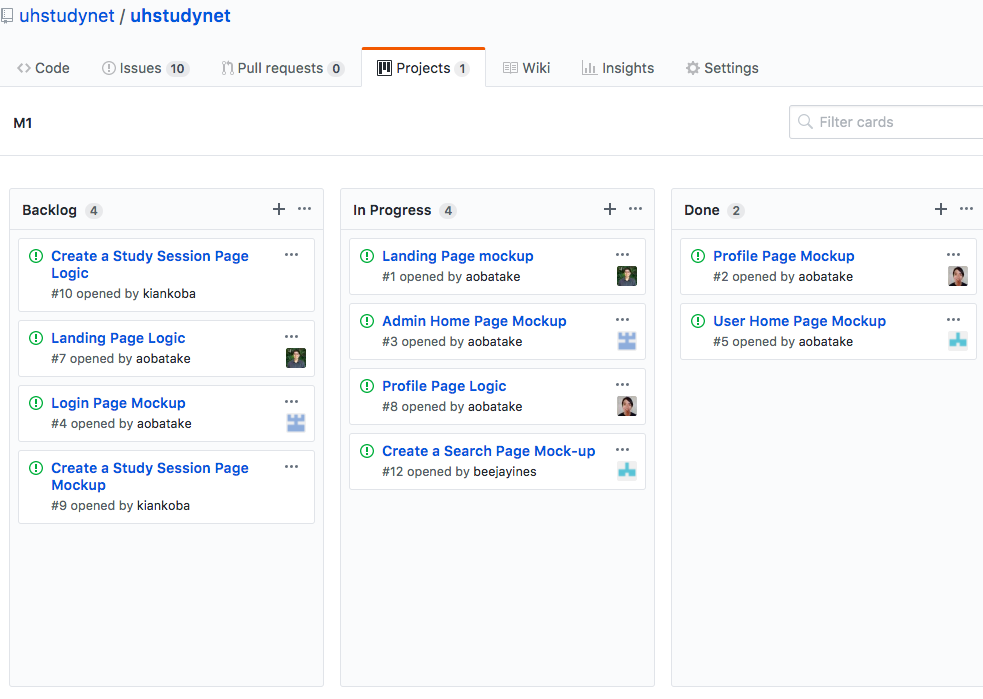

---
layout: project
type: project
image: ../images/LandingFinal.png
title: RUNba Rush
permalink: projects/meteor
date: 2018
labels:
  - Game Design
  - Unity
  - Global Game Jam 2018
  - Open Source
  - Hackathon
summary: The Global Game Jam is an annual hackathon. 
---

 

## A Meteor Web Application that benefits the UH student community
  

  

  
The UH Study Net was a team project designed to implement the skills we have learned during our Software Engineering course at the University of Manoa. On a broad scale, these skills include front end to back end web development as well as the application of the most prevalent software design patterns. Aside from the technical skills we learned from this project, we also used issue driven developmentto handle our workflow. The version control was handled using git and in order to seperate the stages of the project we used GitHub's project feature and created a different project for each Milestone. Milestones were broad, such as a mockup phase or intial functionality phase. Within each milestone, the issues that we would bring up as a team would be picked up and worked on with individual branches for each issue. Once an issue was finished we would merge the branch to master. This allowed our team to work in parallel on multiple issues at the same time. 
   

  

  
Here is a to the website github page which goes into more detail of all stages of the project: [https://uhstudynet.github.io/](https://uhstudynet.github.io/). 

