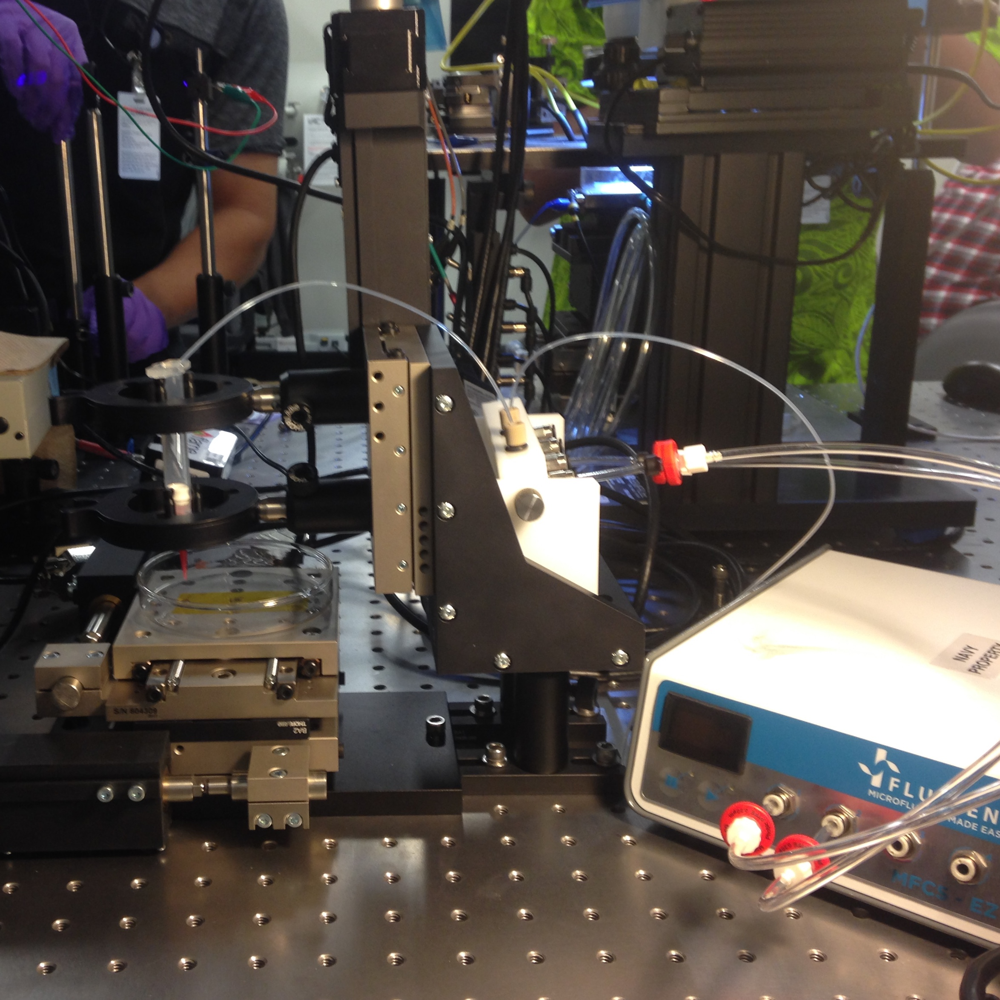
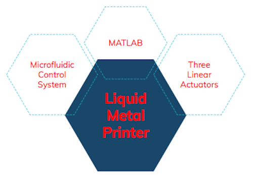
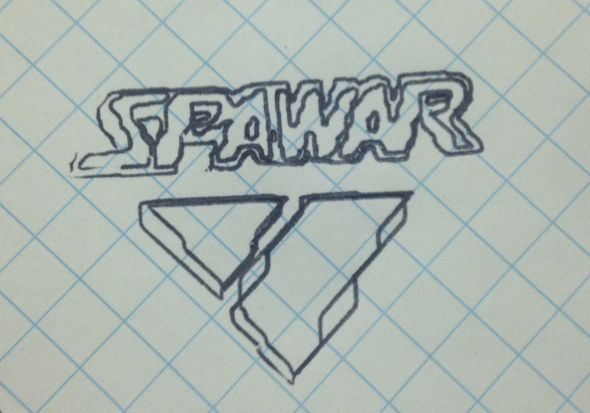
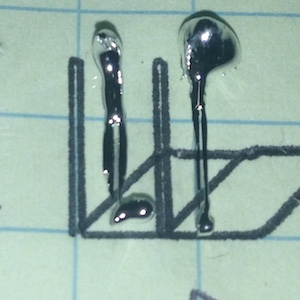

  

## Background
The GPri is a result of my Summer internship of 2017 at SSCPAC (SPAWAR Systems Center Pacific). I was invited to work in the Graphene Microfluidics Laboratory (GML). When I arrived the GML team had already passed their proof of concept phase by creating a graphene transistor. Their goal during this Summer was to miniturize their devices and my project was an effort to automate that process. Thus, the goal for the GPri (Galinstan Printer) was drafted. 

### My overall goal for this project was to assemble, test & prototype a research instrument that deposits Galinstan with high precision accuracy (in the 10^1 microns range). 

So what is <b>Galinstan</b>? Galinstan is one of the compounds known casually as "liquid metal". It is a portmateau of its chemical components: Gal-In-Stan = Gallium, Indium, Tin (Stannum). Liquid metals are alloys that are liquid at room temperature. The Graphene Microfluidics Lab found interest in liquid metal for its potential use in flexible electronics. Liquid metal is also ideal because it provides a more reliable contact for the source and drain of transistors, as opposed to rigid metals. 

The proposed GPri would perform the same way that an ink jet printer would, except with liquid metal. In order to achieve a *miniaturized graphene device*, the liquid metal channels (or printed lines in essence) would ideally be around 50 microns in width. 

## Parts
<ul>
  <li><b> THOR LABS DRV-014 Linear Actuators + BSC203 Control Unit </b></li>
  <ul>
    <li> 409,600 µSteps / 50 mm  </li>
    <li> Less than 1 µm bidirectional repeatability </li>
    <li> Up to 50 nm resolution </li>
    <li> ActiveX Platform for MATLAB Interfacing </li>
  </ul>   

  <li><b> Fluigent (MFCS-EZ) Pneumatic Pressure Control System </b></li>
  <ul>
    <li> Performance based on fluid used.... No references for Liquid Metal </li>
    <li> Microsoft Dynamic Link Library for MATLAB interfacing </li>
  </ul>
</ul>

## Software Development

  

The parts listed above were developed independently and so their provided factory software tools would not interface together to perform our intended goal. However, both of these devices included MATLAB SDKs that allowed me to write a synchronous code, so that the GPri could function as one unit. The DRV-014 actuators (paired with the BSC 203 controller) came with an ActiveX platform. The ActiveX platform is a Microsoft Component Object Model (COM). This provides a binary interface between the OS and the program and creates a container environment. In this way, MATLAB would act as the *client*, while the ActiveX control would act as the *server*. MATLAB documentation for the ActiveX platform provides several accessible methods, properties, and events that were used to control the actuators. 

The Microfluidic Control System (MFCS-EZ) could interface with MATLAB through a Microsoft Dynamic Link Library (DLL). I was happy to find that the DLL used a C calling convention because that is the language that I'm most comfortable with. The elements in the library were accessed through provided function handles. 

## Development Process and Challenges
My primary challenge to start was to learn MATLAB. I was barely acquainted with MATLAB prior to this project, but as I researched the tools, I quickly realized that it was very similar to C and C++. 

Since the GPri was inteded to be a tool for the GML team, I started my program design based on their typical use case. The team would use this instrument to print liquid metal channels for a circuit. The circuit design can be produced from a variety of CAD tools, which as a result, typically create g-code files for a CNC machine. So I wanted my software to include a G-code interpreter. By hacking a series of opensouced g-code interpreters, I was able to produce an algorithm that would translate g-code specifically for my stages. The algorithm would parse the g-code file first into used and unused commands. The used commands would go through a series of further parses to decide the vector path taken for the actuators. The used and unused commands would be stored for later analysis or debugging if necessary into separte files. 

The next step was to relay these vector paths to the actuators and control them accordingly. I found several functions that proved useful in the ActiveX SDK. One was the MoveHome function that would slowly move the stages to 0mm. This was a necessary step for initialization. A similar function, MoveAbsolute, would move to an absolute location based on the last speed setting. Other useful functions allowed for inputs of speed, acceleration, and bow indexes. There also were useful functions that returned channel identifiers, bit comparison results, or general boolean assertions. I was able to integrate these functions into my vector parser so that the stages would either be active or not depending on the intended vector path. While the actuators were completing the vector paths, a graph would display the movements in real time to monitor progress. 

The g-code interpreter was first tested independently from the microfluidic control system. I used a pen and attached it to the Z-stage in place of the liquid metal syringe to save costs during development. Liquid metal is very expensive and so I needed to test with a more disposable product. (See image below)

   

The next step was to experiment with algorithms for the microfluidic control system. Using the provided MATLAB DLL, I was able to control the hardware element. I could replicate the basic, start, stop, and adjustment in pressure that the default software provided. I could also change channels in the event that more than one fluid was used. To experiment this control, I used water with food coloring, so that I could watch the water flow through the tubing and into a petri dish.  

The major challenges that followed were experienced while using liquid metal. The chemical properties of liquid metal are low viscocity, but with high surface tension. Low viscocity means that the compounds break more easily and so it tends to *flow* much faster. Here are a few fluids and in order of viscocity to give a better picture: water < liquid metal < honey < peanut butter. Viscocity is what allows liquid metal to be manipulated in ways that a solid metal cannot be. However the challenging element of liquid metal is its surface tension. High surface tension means its resistance to break at its surface. Thus, when we were attempting to extrude the liquid metal from the syrigne, it would *ball up* to the syringe or the surface of the slide (see image below). This was a problem because our goal was to print and automate straight lines. We concluded from this challenge that a future task to create a successful printer would be to apply an electric field to attract the liquid metal to the surface of the glass slide. 
  

  

   
Even though this challenge decreases the *automation* element of the printer, I was still able to test the precision of distance that the stages software could recognize and translate to the stages. The photo above shows a series of rectangles. First, the rectangles were printed in ink from a pen onto the graph paper. Then the same rectangle design was used for the liquid metal samples to be printed on glass. The width of the rectangle is 0.5mm (500 microns) in the design. For reference the blue lines on the graph paper are 6.35mm apart (0.25in or 6,350 microns). So by a conservative estimation, we have shown that these actuators can accurately print models within 10^2 micron accuracy. With further work, we hope to improve this by altering our method for deposition of the liquid metal. 

## Summary
<ul>
  <li> Designed and constructed a galinstan (liquid metal) deposition system for graphene transistor prototyping, which enables smaller feature sizes and improved device performance. Future work needed for optimizing the liquid metal transfer. </li>
  <li> Synchronized 3 linear actuators with a microfluidic control system by creating a MATLAB interface from provided software development kits </li>
<li> Investigated the physical properties of liquid metal and the effect those properties have for automated fluid deposition </li>
</ul>

