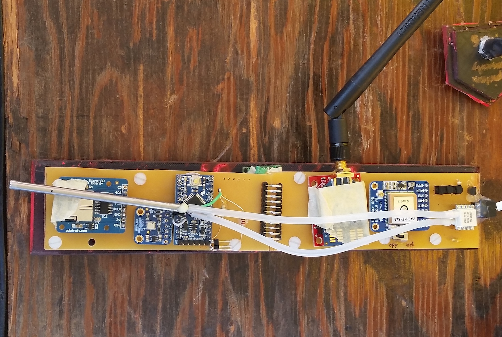

  

<b> Mission Scope </b>
CanSat is a NASA sponsored event in which teams worldwide compete to simulate a Mars payload descending, recording and transmitting atmospheric measurements to be submitted to a ground station. The focus of this annual competition is to recreate the engineering research and design process that makes a Mars landing possible. The 2016 CANSAT mission was to create a payload as well as a container for protection from launch. Once the payload begins to descend it must be released from the container, and from there, descend in a circular pattern within a fixed radius. Throught the entire flight the payload must record and transmit barometric pressure, speed via GPS location sensor, speed via pitot tube sensor, temperature, and the time regardless of a power disruptance. There are several design limitations that affect the possible part selection such as limits on mass, flight path, cost, and durability. Aside from constructing the payload, each team must present several preliminary designs to a NASA engineer for a research review before the payload launch in Texas. 

  
  

<b> Responsibilities </b>
During this project, I was primarily responsible for programming the sensor integration and flight logic as well as designing the release mechanism for our payload from it's safety cannister. I also contributed in large part to the documentation for each research review. The components for our system included:
<ul>
  <li> Microcontroller: Arduino Pro Mini </li>
  <li> Barometric Pressure Sensor </b></li>
  <li> GPS Location Sensor </li>
  <li> Real Time Clock </li>
  <li> Temperature Sensor </li>
  <li> Pitot Tube Speed Sensor </li>
  <li> SD card reader </li>
  <li> XBee Radio </li>
</ul>
 
<b> Wisdom Gained </b> 
The mass limit heavily influenced the part selection for these electronics based on their size, power, and communication requirements. Most sensors were from popular open source vendors such as Adafruit and Sparkfun. By using the supplied tutorials and other open sourced projects, I learned quit a bit about communication protocols (SPI, I2C, Asynchronous Serial) and how they can work together or interfere with a programs logic. The hardest sensor to integrate was the Pitot tube's MPXV7002 differential pressure sensor. This device was not available from the popular open source vendors, so I was required to find one with enough open source libraries and scour the datasheet in order to use it.

I also learned about research project presentations and project management. I took part in making several budget sheets throughout this process as well as Gantt charts and compare and contrast tables for part or design selection. Another learning lesson was in regards to working in groups. I learned how to find and highlight the strengths of each team member and how to settle disagreements under stressful circumstances. 

<b> Summary </b>
This project really solidified my interest in Computer Engineering. Prior to this experience, I had only taken one semester of C programming and was mildly familiar with the Arduino hardware and software environment. I was very proud when I found out that our 13th place overall award was actually 3rd among the United States schools. At the time I was attending the community college here (KCC, Kapiolani Community Collge) and we were the ONLY community college competing as well. Lastly, I was excited to see how quickly I learned these new skills and finshed curious and excited to see what else could be created from learning in projects such as these. 

