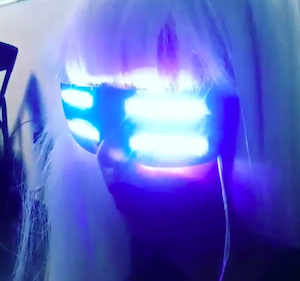

  

<b> Scope </b> 
<b>The scope of this project was to design and build a device that would compliment a cosplay piece for the Amazing Hawaii Comic Con under a three week time frame.</b> So this was a last minute, time to show what you've got, sort of project pitch which added to the excitement of it all in the end. Now HiCapacity is a local hackerspace in Honolulu where I happened to be doing my summer internship. I was very lucky to have access to members of a community from all different backgrounds. From fine arts, electrical engineering, computer science and even molecular biology, the skill support I had on this project really gave me the confidence that I could complete it in time.

<b> Background </b> 
<b>The first step of this project was to think of a costume.</b> I really like the style that Storm from the X-men always had: the contrasting look from the silver white hair, the dark clothes and complexion, and of course the blueish white eyes. Most cosplayers that portray Storm will typically wear white contacts to show this effect. The problem with this is that Storm's eyes were not always white. They only turned white when she was summoning electrical energy for a storm. <b> I decided I wanted to make a controllable piece that would simulate her powers: Storm glasses.</b>

  

<b> Planning </b> 
The materials chosen for the glasses had to be small, cheap, and have lots of supporting documenation because I was very new to programming at the time. The final selection included:
<ul>
  <li> 1 Arduino Pro Mini 5V</li>
  <li> 4 Neopixel light strips (8 RGB LEDs) 5V</li>
  <li> 2 Latching buttons </li>
  <li> 1 PowerBoost Converter & Charger </li>
  <li> 1 LiPo battery 3.3V</li> 
</ul>

<b> Electronic Housing </b> 
I knew when I was designing this piece that I did not want to hide the electronic components. I wanted to showcase them in a subtle way. The glasses were black and dark in order to hide the lights when they were disengaged. For the remaining electronics, I decided to 3D print a layered box style enclousure that was harshly geometric to give it an edgy feel. I used a free software online to create the design and then I printed it with a Makerbot Replicator 2.  I even had the chance of laser engraving a lightning bolt on to the front of the housing for extra style. I also 3d printed four hollow rectangles for the LED strips to sit in, so that the user's eyes would be protected from the light that escaped vertically. Lastly, I chose to use a bulky chain for the necklace and black & white wires to compliment Storm's classic contrasting colors. To secure the parts down, I used a combination of hot glue, velcro, and unused wires to hold everything in place. 
  
<b> Logic </b> 
I wanted the lights (or Storm's eyes) to have more than just a simple on / off switch effect. So using the Arduino libraries and others found online, I was able to work with several advanced programmers to develop <b>3 sequences: Off, Flicker, and Summon the Storm</b>. "Off", consisted of no lights engaged and occured when neither buttons were latched. "Flicker" was much more of a flirty one flash here, one flash there sort of sequence and would occur when the Buck Booster's button was latched. The latching completed the circuit and provided power to the Arduino. This sequence was a great for grabbing attention, without showing the full effect. The second button was connected to a logic pin on the Arduino. When this button was latched, it engaged the "Summon the Storm" sequence. This sequence consisted of sporadic flashing that would eventually light up all of the lights and end in a giant flash! 

  

<b> Results & Panel Discussion </b>  
In the end I was able to successfully construct the glasses in time and the reception was wonderful. I shared my story with around 30 cosplayers that showed up to the panel. I explained that I was a beginner programmer myself, and that I was lucky to have stumbled upon a hackerspace and online open source community that can help anyone learn how to build electronic systems. We discussed the different ways that electronics could enhance a costume and where to go to learn more. Overall it was a very humbling yet encouraging experience. I learned how important it is to have resource networks and I gained experience in full system planning from parts selection to programming. The wearable aspect was really fun as well and allowed me to highlight my creative strengths. 
