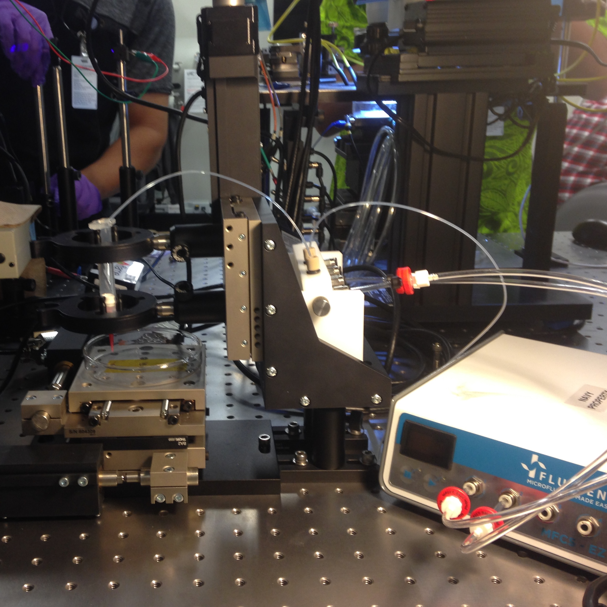

  
  
  

<ul>
  <li> Designed and constructed a galinstan (liquid metal) deposition system for automated graphene transistor prototyping, which enables smaller feature sizes and improved device performance </li>
  <li> Synchronize 3 staged linear actuators with a microfluidic control system by creating a MATLAB interface from provided software development kits </li>
<li> Investigate the physical properties of liquid metal and the effect those properties have for automated fluid deposition </li>
</ul>

